<p align="center">
  
</p>

<h1 align="center">Airlock</h1>

<p align="center"><strong>Selection pressure, not agent spam.</strong></p>

<p align="center">
  <a href="#demo">Demo</a> ·
  <a href="#the-research-discipline">Discipline</a> ·
  <a href="#architecture">Architecture</a> ·
  <a href="#how-the-sponsored-products-are-used">Daytona · Nosana · DNSimple</a> ·
  <a href="#quickstart">Quickstart</a>
</p>

Generation is free now. Any agent can produce a thousand candidates before lunch — the scarce
resource is the judgment that decides which one deserves the next hour of compute, and which
one deserves *yours*. Airlock is an auto-research agent built around that scarcity. Give it a
tabular ML task and it searches **composite structures** — `transform × model × ensemble × hyper`,
a 1,212-cell grid — by running every candidate in a parallel sandbox and applying the discipline
of a research lab to the results: every hypothesis declares its falsifier before it runs,
families of factors are sealed only on isolated + pair + triple evidence, non-additive harm is a
first-class result, and a stalled search gets a *why-critique* with two competing explanations
and the one observation that separates them. A person is asked only at the moments that matter —
with a cost estimate and a default — and gets a champion the ledger can defend.

Built in one sprint for **Daytona HackSprint Seoul**. Experiments fan out to **Daytona**
sandboxes; an open model on **Nosana** answers `why` questions from the ledger.

---

## Demo

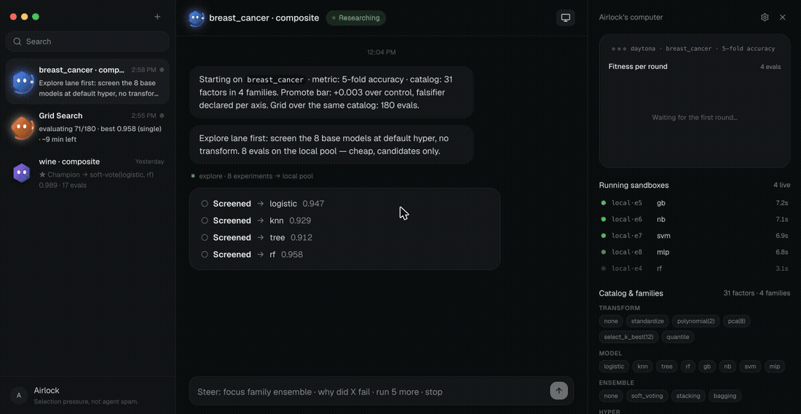

▶ Higher quality: [`demo/v3/airlock-demo.mp4`](demo/v3/airlock-demo.mp4) (H.264, 1.5 MB).

The recording and the stills below are the real UI replaying a **scripted three-minute lab**
(`http://127.0.0.1:8770/?mock=1`) so the stage demo is deterministic. The same UI drives live
labs; the numbers from a live run are in [What a real run looks like](#what-a-real-run-looks-like).

| | |
| --- | --- |
| 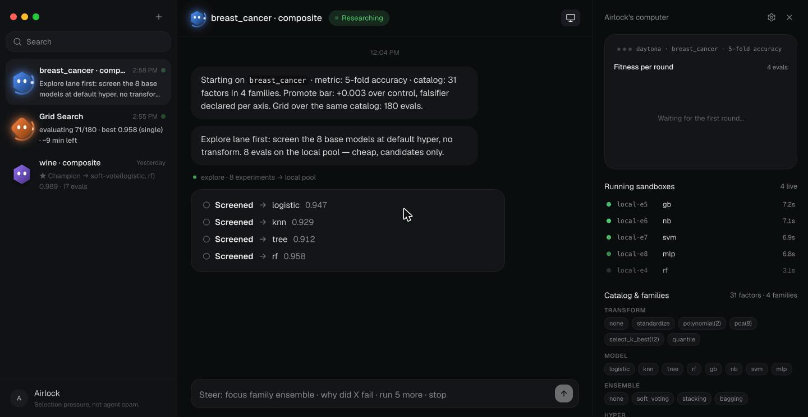 **Start.** One sentence in, the lab opens: dataset, metric (5-fold accuracy), the 31-factor catalog, and an explore screen of every single model. | 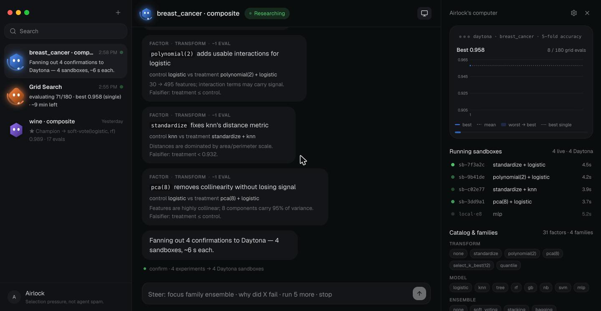 **Hypotheses → Daytona.** Each hypothesis names its family, control, treatment and falsifier *before* it runs; the batch fans out to Daytona sandboxes in the right pane. |
| 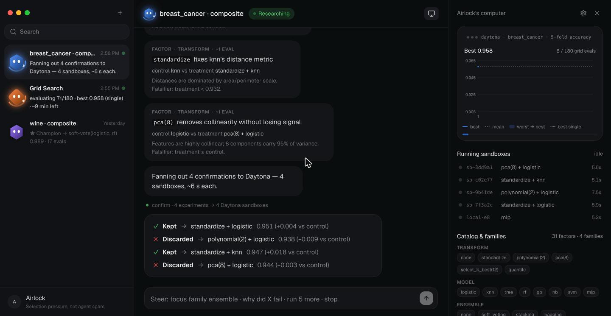 **Gated results.** Every result comes back as ✓ promote / keep or ✗ discard with a measured Δ against its own control and a one-line reason. | 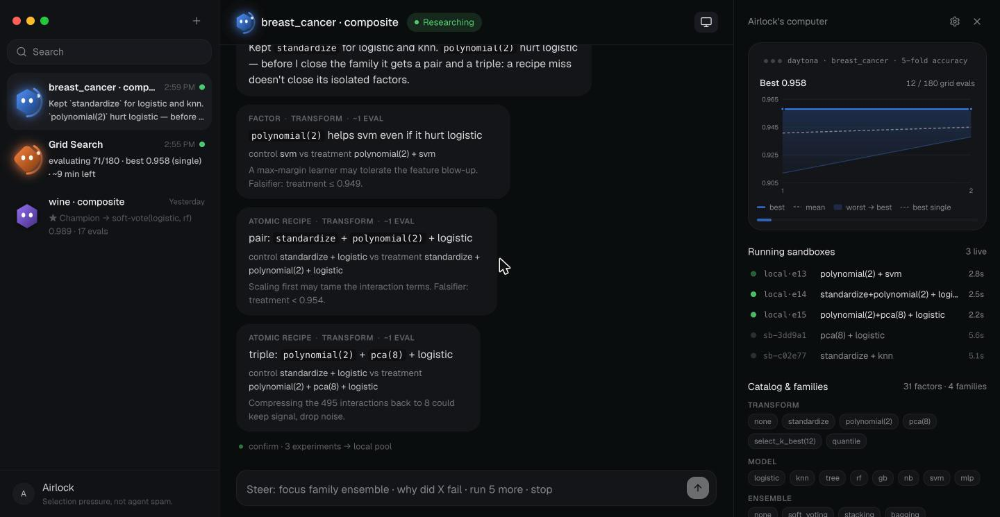 **A recipe miss never closes a factor.** A failed pair does not seal the factors inside it — only isolated evidence can do that. |
| 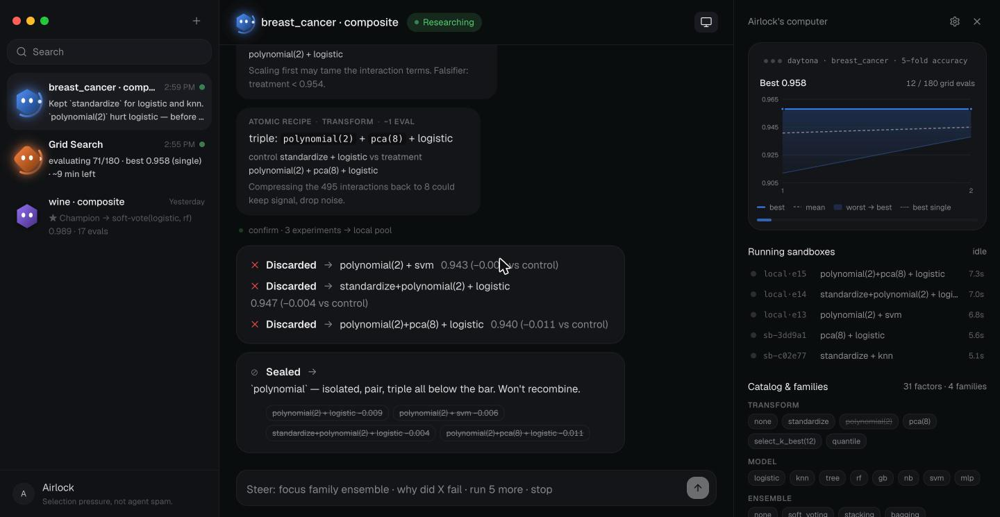 **Family sealed.** `polynomial` missed the bar isolated, in a pair and in a triple; it is crossed out in the catalog and no recipe containing it is legal again. | 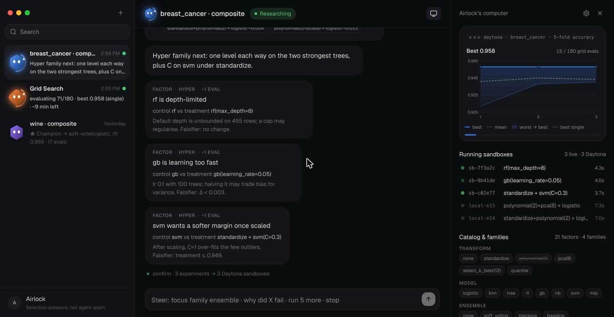 **Hyper round.** Regularisers on the champion, with the fitness band (best / mean / worst per round) climbing above the best-single line. |
| 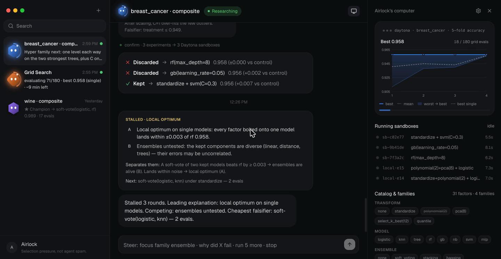 **Stalled → why-critique.** Three rounds without a promote: a stagnation grade, two competing explanations, the separating observation, and the cheapest experiment that can falsify the leading one. | 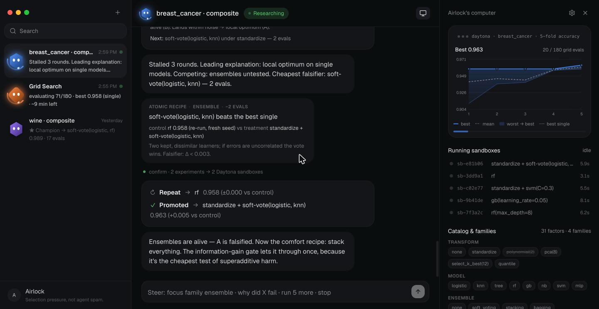 **Falsifier promoted.** The cheapest falsifier — a soft vote — clears the bar and replaces the champion. |
| 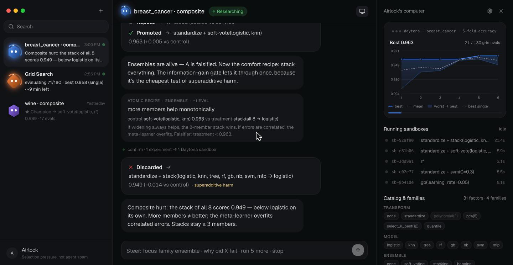 **Superadditive harm.** An ensemble scoring *below its own best member* is not a miss, it is a finding: the combination is recorded and sealed. | 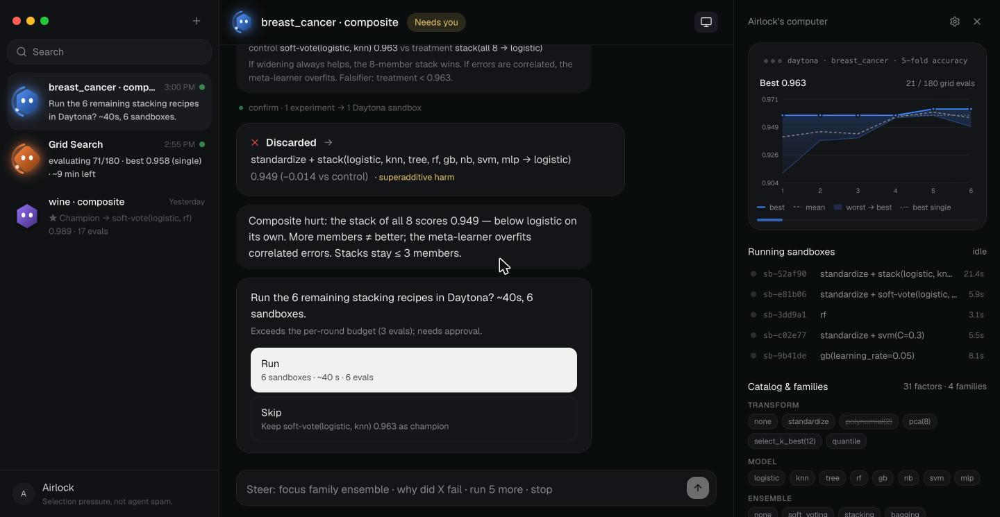 **Needs you.** Before an expensive stacking batch the agent asks — with an eval count, a time estimate and a default it will take if you walk away. |
| 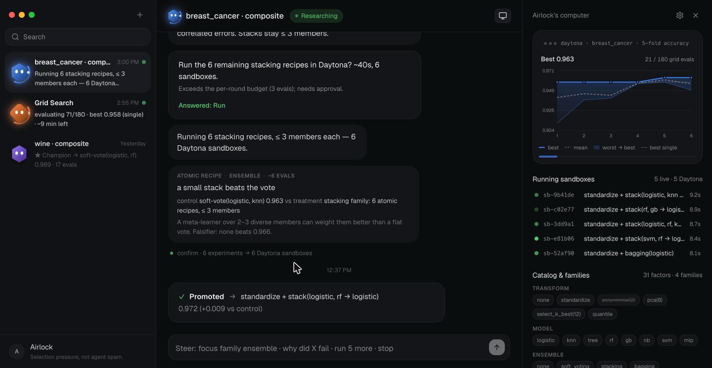 **Stacking on Daytona.** Eight stacking recipes run in parallel sandboxes; one promotes. | 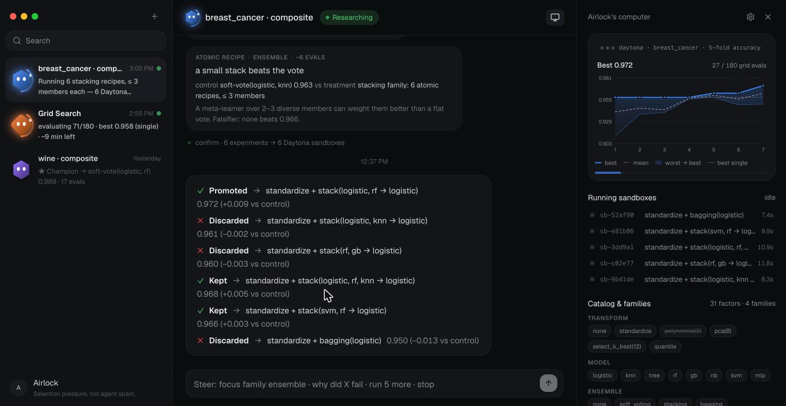 **Stacking results.** The rest are discarded with reasons; the ledger keeps all of them. |
| 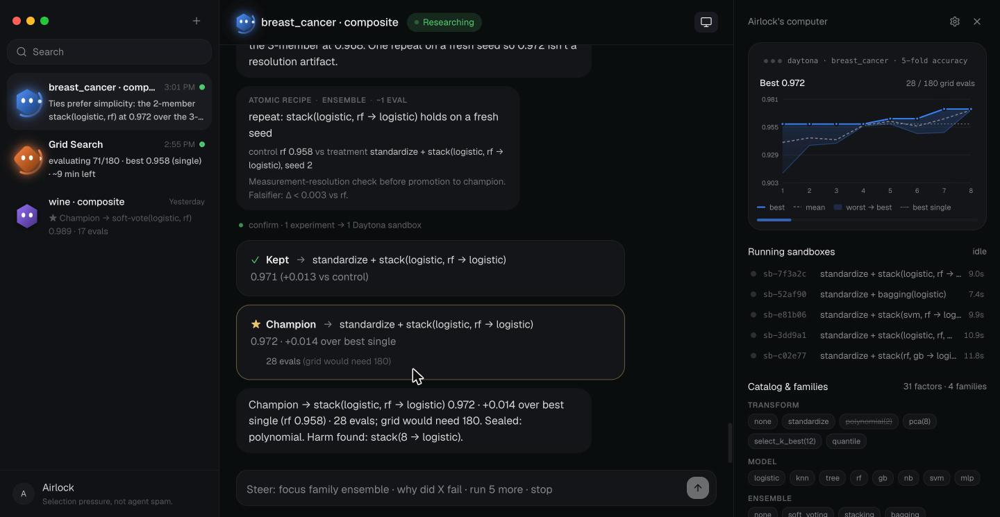 **Champion.** `standardize + stack(logistic, rf → logistic)` at 0.972, +0.014 over the best single model, in 28 evals where a grid needs 180. | |

### What a real run looks like

Two live labs against the same catalog, today — one on the local process pool, one with every
experiment executed in a **Daytona** sandbox pool (4 sandboxes, official SDK):

| | Local pool | Daytona pool |
| --- | --- | --- |
| Evals | **37** of a **1,212**-cell grid | **43** of 1,212 |
| Champion | `standardize + logistic (C=0.1)` — **0.976** | `standardize + logistic (C=0.1)` — **0.979** |
| Best single model | `rf` 0.963 → composite is **+0.013** | `rf` 0.963 → **+0.016** |
| Gates | explore_only 8 · discard 23 · promote 2 · keep 2 · repeat 1 | — |
| Sealed families | none | `reduction`, `voting` |
| Harmful composites found | 8 | 8 |
| Wall clock | 37.8 s | 137.7 s (sandbox round-trips) |
| End state | HOLD — no falsifier left that passes the information-gain gate | HOLD |

Unedited captures from the Daytona lab (the sandbox ids in the right pane are real):

| | |
| --- | --- |
| 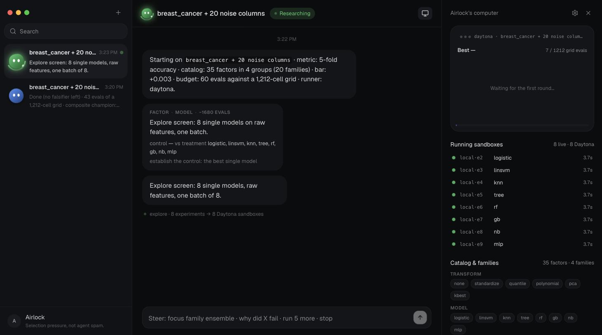 **t+3 s.** The explore screen fans out: `8 live · 8 Daytona`. | 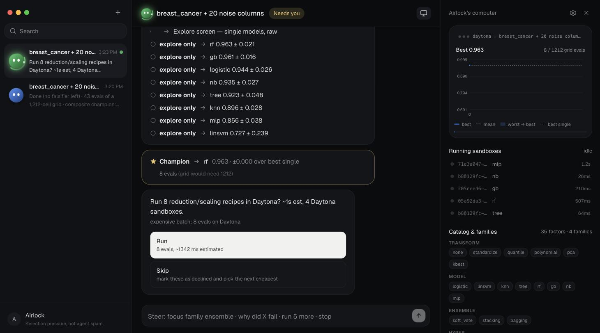 **t+10 s.** Best single found (`rf` 0.963); the agent asks before an 8-eval Daytona batch, with a cost estimate and a default. |
| 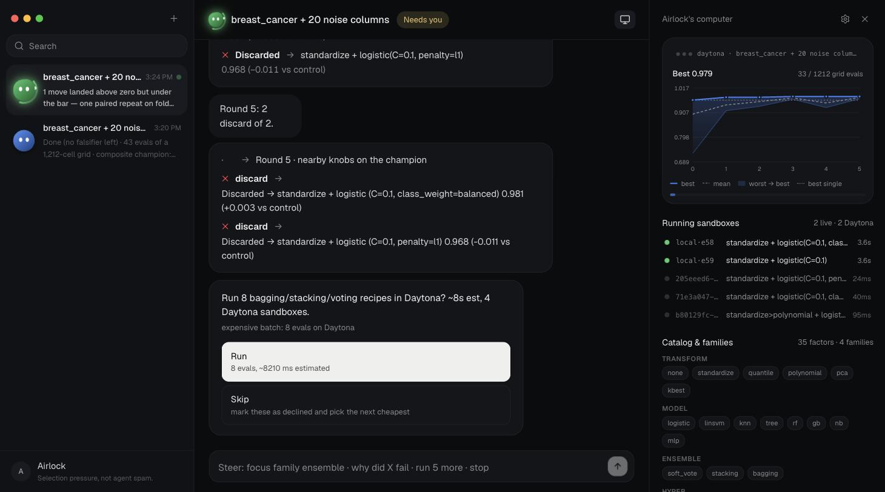 **t+60 s.** Champion at 0.979 after the hyper round; two nearby knobs discarded with their Δ; a second, pricier ask (stacking, ~8 s). | 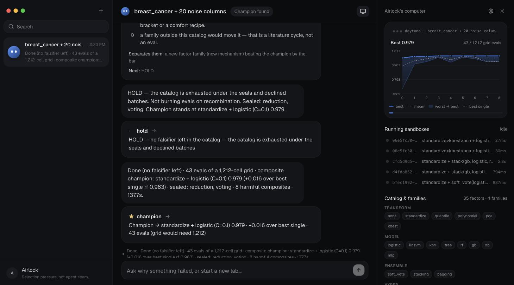 **Done.** 43 evals, two families sealed, HOLD with a why-critique — and the finished lab replays from the ledger with its sandbox ids intact. |

---

## Why this is different

| | Grid / AutoML | "Agent spam" (best-of-N) | Airlock |
| --- | --- | --- | --- |
| What it varies | Every cell, blindly | Whatever the model feels like | One declared factor or one atomic recipe per hypothesis |
| Who scores | A metric | Often another model | A metric, always — the model never scores |
| What it learns from a miss | Nothing | Nothing | Evidence for a family; seals it at isolated + pair + triple |
| Combinations that hurt | Invisible | Invisible | First-class result (`superadditive harm`), sealed |
| When it stops | Budget | Budget | HOLD, when no experiment left can falsify the leading explanation |
| When it asks you | Never | Constantly | Before expensive batches, with a cost estimate and a default |

On **AlphaEvolve**, honestly:

- AlphaEvolve evolves *code* against a hard objective with Google-scale infrastructure. Airlock
  does not compete with that; it takes the other half of the problem — **selection** over a
  composition space, with the falsification discipline written down as gates.
- AlphaEvolve is closed. Airlock is a few thousand lines of Python and TypeScript that anyone can
  run on a laptop, and the parts that need a model use open models.
- The execution seam AlphaEvolve leaves to the user — where does each candidate actually run? —
  is what Daytona fills here: one sandbox per experiment, from a pool, in seconds.

---

## The research discipline

These are not prompts. They are the rules `airlock/research/loop.py` enforces.

- **Three lanes.** `explore` screens every single model raw in one batch and makes the best one
  the control. `confirm` rounds test declared hypotheses against that control. `repair` re-runs
  a sub-bar positive on a second fold seed instead of believing one lucky split.
- **Six gates.** `promote` (≥ `min_delta` over the champion — the champion is replaced), `keep`
  (≥ `min_delta` over its own control — that member's new best), `repeat` (0 < Δ < `min_delta`
  on the champion → one paired re-run, then gated on the paired mean), `discard`, `explore_only`
  (screen results are candidates, never promotions), `crash` (evaluator error — not scientific
  evidence).
- **A promote bar with a declared falsifier.** `min_delta = 0.003` by default, chosen against the
  fold-to-fold noise. Every `Hypothesis` carries `why` and `falsifier` strings written before the
  experiment launches; they are shown in the chat and stored in the ledger.
- **Family sealing from isolated + pair + triple evidence.** Every non-crash result is evidence
  for the hypothesis' family at its *order* (1 = isolated, 2 = pair, 3+ = triple). A family whose
  isolated, pair and triple evidence all miss the bar — and that never passed — is sealed: no
  recipe containing it is legal again. **A recipe miss never closes the isolated factors inside
  it.**
- **Non-additive harm is a result, not noise.** An ensemble or a knob combination that scores
  below its own best member minus `min_delta` is gated `discard` with reason
  `superadditive harm`, the combination is sealed, and the harm is listed in the final report.
- **Stagnation has a grade.** After `stagnation_k = 3` rounds without a promote the loop writes a
  why-critique: one of `local_optimum · family_tax · superadditive_harm · measurement_resolution
  · frozen_axis · information_gain`, **two competing explanations**, the **one observation that
  separates them**, and the next experiment.
- **Cheapest falsifier.** The next experiment is the cheapest unresolved candidate that can
  falsify the leading explanation *and* passes the information-gain gate: no sealed-family
  recombination, no closed-bracket retry, no comfort recipe, no zero-information cell (a scaler
  in front of a tree is never launched — zero expected information). Nothing qualifies → **HOLD**,
  and the loop stops spending evals.
- **Metric is truth.** Fitness is stratified k-fold CV accuracy computed by scikit-learn. The
  champion's number is the primary fold seed's; repeat seeds only ever feed the paired delta, so
  a champion never drifts after a repeat. `crash ≠ discard`.
- **The human is asked, not spammed.** Before a batch above the cost threshold the agent emits an
  `ask` with the eval count, a time estimate, a `Run` / `Skip` choice and a 30-second default. A
  lab can also be steered at any time (see below).

---

## Architecture

```
  browser (React 19 · Vite · Tailwind v4 — Rakazo-style agent chat)
      │  POST /api/labs · /steer · /answer
      │  GET  /api/labs/{id}/stream   ← Server-Sent Events, replayed from event 0
      ▼
  airlock/server.py        Python 3.12 stdlib ThreadingHTTPServer + Broker (no framework)
      │  one worker thread per lab
      ▼
  airlock/research/loop.py ResearchLoop — lanes · gates · families · critique · asks
      │  evaluate_many(specs, on_result)                 ┌─ runs/labs/<id>/ledger.jsonl
      ├──────────────────────────────────────────────────┤  champion.json · state.json
      ▼                                                  └─ (append-only research record)
  airlock/research/runners.py
      ├─ LocalRunner    multiprocessing pool, cpu_count − 2 workers
      └─ DaytonaRunner  pool of N Daytona sandboxes (scikit-learn image), shared spec queue
                        ▲ each experiment = airlock_eval.py spec.json inside a sandbox
  airlock/llm.py          optional open model (Nosana / any OpenAI-compatible /v1)
                          answers `why …` from ledger rows · writes the closing insight
                          never produces a score
```

### Repository layout

```
airlock/
  airlock/
    __main__.py            python3 -m airlock
    server.py              HTTP + SSE: labs, stream, steer, answer, health; serves web/dist
    config.py              env-driven Config (.env honoured); provider labels for /api/health
    llm.py                 LLM client: narrate / explain (Nosana or any OpenAI-compatible base)
    research/
      catalog.py           35 factors in 4 groups, 20 families, recipe ids, legality, cost estimates
      config.py            ResearchConfig: dataset, folds, min_delta, stagnation_k, max_evals, asks
      evaluate.py          the pure evaluator: recipe → sklearn Pipeline → k-fold CV metric
      loop.py              ResearchLoop (the methodology as a program)
      ledger.py            append-only ledger per lab
      runners.py           LocalRunner · DaytonaRunner · get_runner(cfg)
    generate.py sandbox.py measure.py deploy.py pipeline.py   (earlier landing-page pipeline, kept working)
  web/                     Vite + React + TypeScript + Tailwind v4 chat UI (src/mock = scripted demo)
  tests/                   unittest: engine API, event contract, legacy pipeline
  demo/v3/                 GIF · MP4 · 13 stills used above
  verify_daytona.py        live round-trip against a real Daytona account
  verify_nosana.py         live check of the Nosana / OpenAI-compatible endpoint
  run.sh · .env.example · SPEC.md · LICENSE · NOTICE
```

### Event stream

Every lab is a stream of JSON events (`web/src/types.ts` is the contract). The UI is a pure
function of this stream, which is why a late subscriber — or `?mock=1` — renders identically.

| Event | Meaning | UI |
| --- | --- | --- |
| `lab_started` | task, metric, catalog summary, providers, budget | header, catalog chips, provider chip |
| `hypothesis` | family, control, treatment, cost estimate, `why` | hypothesis line in chat |
| `experiment_started` | lane, spec, runner, `sandbox_id` | live row in *Running sandboxes* |
| `experiment_result` | metric, std, Δ vs control, `gate`, reason | ✓ / ✗ / ⊘ result card |
| `family_sealed` | family + the evidence that sealed it | sealed card; family crossed out |
| `stagnation` | grade, two explanations, separating observation, next | why-critique card |
| `champion` | spec, metric, Δ vs best single, evals used vs grid | ★ champion card + right-pane card |
| `ask` | question, options with details, reason | *Needs you* card with buttons |
| `agent_message` | one calm line, optional cards | agent bubble |
| `progress` | evals done / grid, best, best single, per-round history | fitness chart + progress bar |
| `done` | summary + stats | closing bubble, status → done / hold |

### HTTP API

| Method & path | Body → response | Notes |
| --- | --- | --- |
| `POST /api/labs` | `{prompt, task?, budget?, seed?}` → `{lab_id}` | starts a `ResearchLoop` in a worker thread |
| `GET /api/labs/{id}/stream` | — → `text/event-stream` | replays from event 0, then live; keep-alive every 15 s |
| `POST /api/labs/{id}/steer` | `{text}` → `{ok, lab_id}` | steering message (below) |
| `POST /api/labs/{id}/answer` | `{ask_id, option_id}` → `{ok, lab_id}` | releases a blocked `ask` |
| `GET /api/labs` | → `[{id, title, last_message, updated, status}]` | sidebar list |
| `GET /api/health` | → `{ok, providers: {runner, sandbox, llm, deploy}, config, …}` | which providers are live |

### Steering

Type into the chat while a lab runs:

| Command | Effect |
| --- | --- |
| `stop` | finish the current batch, keep the ledger, write the report |
| `focus <family>` | that family's candidates run first (nothing else is forbidden) |
| `skip <family>` | no candidate from that family is launched until you `focus` it again |
| `why <spec or family>` | the evidence for a family, or what happened to a spec such as `standardize\|logistic` — and, with an LLM configured, a grounded answer over those ledger rows |
| `run <n> more` | extend the eval budget by *n* |

---

## How the sponsored products are used

### Daytona — where every experiment runs

`airlock/research/runners.py::DaytonaRunner` provisions a **pool** of sandboxes once
(`AIRLOCK_DAYTONA_POOL`, default 4) from a `debian_slim("3.12")` image with scikit-learn, uploads
a small self-contained driver (`airlock_eval.py` plus the catalog and evaluator), and then has
each sandbox pull specs from a shared queue and run `python3 airlock_eval.py spec.json`. Results
stream back in completion order, so the chat shows each experiment finishing live with its
`sandbox_id`. Per-candidate cost is seconds, not a boot. The official `daytona` Python SDK
(0.214.0) is used as-is — `Daytona(DaytonaConfig(api_key))`, `create()`, `fs.upload_file`,
`process.exec`, `delete()`. If the SDK, the key or the network is missing the runner degrades to
`LocalRunner` with a logged reason, never a crash.

```sh
echo 'DAYTONA_API_KEY=…' >> .env        # gitignored, never printed
python3 -m venv .venv && . .venv/bin/activate && pip install daytona scikit-learn numpy
python3 verify_daytona.py                # PASS: sandbox created (≈4.8 s), exec, preview URL, teardown
./run.sh                                 # /api/health → "runner": "daytona"
```

### Nosana — the open model that explains, never scores

Deploy an open model (Qwen, Llama, …) on Nosana's GPU network; the deployment exposes an
OpenAI-compatible `/v1` URL. `airlock/llm.py` talks to it with nothing but `urllib`:

- `why <spec|family>` → `LLM.explain(question, ledger_rows, champion)` — a RAG answer restricted
  to the ledger rows shown, told to cite specs and deltas verbatim and to say so when the ledger
  does not contain the answer.
- At the end of a lab → a two-sentence closing insight written from the measured summary.
- Fitness is **never** asked of the model. Without an endpoint every message falls back to a
  deterministic template and the product is unchanged.

```sh
echo 'AIRLOCK_LLM_BASE=https://<deployment>.node.k8s.prd.nos.ci/v1' >> .env
# AIRLOCK_LLM_KEY=   (leave empty for an open deployment)   AIRLOCK_LLM_MODEL=  (empty → first listed)
python3 verify_nosana.py                 # lists models, runs narrate + explain, prints PASS/FAIL
```

The right pane shows the provider as a chip (`Nosana`) once the lab starts, and
`GET /api/health` reports it under `providers.llm`.

### DNSimple — publishing a result

`airlock/deploy.py::DNSimpleDeployer` creates a subdomain record via the DNSimple API
(`DNSIMPLE_TOKEN`, `DNSIMPLE_ACCOUNT`, `DNSIMPLE_DOMAIN`) and is wired into the earlier
landing-page pipeline as an optional deploy step. It is **not** yet on the research-lab path —
publishing a finished lab's report to a subdomain is configured but not exercised by the demo.

---

## Quickstart

```sh
git clone https://github.com/yc9954/airlock && cd airlock
python3 -m pip install scikit-learn numpy      # the evaluator; everything else is stdlib
./run.sh                                       # builds web/dist if needed, opens http://127.0.0.1:8770
```

- **Scripted demo:** open `http://127.0.0.1:8770/?mock=1` — the three-minute lab from the GIF,
  with no keys and no compute.
- **Live lab:** type a prompt (or press Enter on the default) — runs locally on
  `cpu_count − 2` workers. Add `DAYTONA_API_KEY` to `.env` to run it in sandboxes.
- **Keys:** copy `.env.example` to `.env`. Every key is optional; `.env` is gitignored.
- **Frontend dev:** `cd web && npm install && npm run dev` (Vite proxies `/api` to `:8770`).
- **Tests:**

  ```sh
  python3 -m unittest discover -s tests            # 24 tests: engine API, event contract, legacy pipeline
  cd web && npm run build                          # tsc -b + vite build (type-checks the UI)
  ```

Requirements: Python 3.10+ (3.12 used), Node 20+ for the UI build, `scikit-learn` + `numpy` for
the evaluator, `daytona` only if you want sandboxes.

---

## Design

The chat surface follows the **Rakazo** agent-chat design — three panes (labs · chat ·
"Airlock's computer"), 20 px message bubbles, result and ask cards, bot avatars — with its design
tokens vendored verbatim under Apache-2.0 (see `NOTICE`; components here are original). The
brief was *calm on the surface, rigorous underneath*: the chat reads like a colleague reporting,
the right pane shows the raw experiment lifecycle, sandboxes and the fitness band, and nothing
that is not measured gets a number.

---

## What is real and what is scripted

- **Real:** the research loop, the gates, family sealing, harm detection, the why-critique and
  the HOLD condition; k-fold evaluation via scikit-learn; the local process pool; the Daytona pool
  runner (verified live with `verify_daytona.py`); the SSE server and replay; the ledger on disk;
  the Nosana/OpenAI-compatible client.
- **Demo task:** scikit-learn's `breast_cancer` (569 × 30) plus 20 engineered Gaussian noise
  columns with log-uniform scales, so scaling and feature selection have real work to do. Swap
  the dataset with `AIRLOCK_DATASET`; nothing in the loop is dataset-specific.
- **Scripted:** `?mock=1` replays a canned event stream through the real UI so the three-minute
  stage demo is deterministic. Its champion (0.972 in 28 evals, grid 180) is illustrative; the
  live numbers are in the table above.
- **Default runner is local.** Daytona is used when `DAYTONA_API_KEY` is present; the LLM layer
  is optional and template-backed without an endpoint; DNSimple is configured for the earlier
  pipeline only.
- **Not yet:** resuming a lab from `state.json`, datasets beyond tabular classification, and a
  cost model for sandboxes beyond the per-recipe estimate.

---

## License

MIT — see [`LICENSE`](LICENSE). Third-party notices (Rakazo design tokens, Apache-2.0; Daytona
SDK) are in [`NOTICE`](NOTICE).
